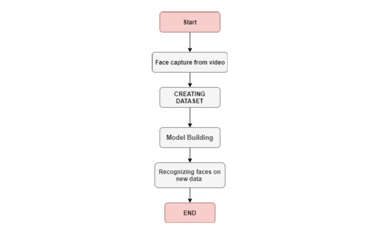

# Perceptron_3038
Create-A-Thon 2020 Project Repository

Steps:  
1)Capturing faces from the training video using haarcascode_frontalface_default.xml  
2)Extracting these frames to training folder.  
3)Training VGG16 model on this extracted dataset.  
4)Capturing faces from other videos and analyse them using our trained model.  

<h1># Create-a-thon 2020 Final Project : Team : Perceptron_3038</h1>

<h2>Project title : Facial Recognition in Criminal Detection. </h2>

About Sapio Analytics
Sapio is a team spread across India, UK, and Silicon Valley, focused on creating high end data based algorithms powered by AI, on the path to become the first purely artificially intelligent policy making system in India and probably the world. Its on its path to become the go-to product for any government body to take decisions- the go-to product that all stakeholders (government representatives, citizens, data experts) would want the government to use before taking decisions.

<h4>Problem Statement: Build a face recognition analytics system for law enforcement agencies </h4>

<h4>Problem Description: </h4>
The security of India is becoming ever more critical in this new world. There is an expectation of a slew of organized crime activities that may attempt to cripple our law enforcement and defense agencies. In such a scenario, technology becomes of paramount importance.

One aspect of the use of technology in law enforcement is video analytics, and video analytics has various components. One of the components is to identify patterns across different videos.

The task here is to analyze a 30 second- 1 min video, and capture faces of the people in the same, and then analyze another video to see how many of the persons in the first video are seen again in the second video and at what times.

Now, if the above technology is used for thousands of videos gathered from hundreds of intelligence sources, with cross-checks across all videos, really significant information on patterns in any form of organized crime can be identified.

<h4>Allowed Tech Stack Use: </h4> 
Python OpenCV (even if you are not good in Python, we recommend you try in whatever you can)

<h4>Steps in the challenge:</h4>
Get yourself a token from Registration deck
Attend the inaugration
Read and Understand the problem Statement
Start developing
Attend Shout-outs
Check-in code at stipulated checkpoints
Finish your code
Participants will be shortlisted on 5th July
Shortlisted participants will get a chance to work on maturing their solution for the next 5 days
After 5 days, finalists will be announced

<h4>Challenge format: </h4>
Phase 1: 12-hour hackathon
Shortlisted ones will get a chance to participate in Phase 2
Phase 2: 5-day hackathon

<h4>Eligibility:</h4>
Your team should be less than 5 members
Your team should have at least 1 Internity intern

<h4>FAQs</h4>
Should we create a table for getting the details of the candidate
You can use anything you want(RDBMS or NoSQL), what matters is an information storage and retrieval
What will be in the next phase
In the next phase, integration with other platforms like Github, Kaggle, Hackerrank and other competitive programming platforms and make the algorithms more mature to get the best results
Who should I connect for assistance
Please connect with your coaches or the Create-A-Thon execution team.

Task 1
Analyze a 30 second- 1 min video, and capture faces of the people in the same.

Task 2
Analyze another video to see how many of the persons in the first video are seen again in the second video and at what times.

Task 3
if the above technology is used for thousands of videos gathered from hundreds of intelligence sources, with cross-checks across all videos, really significant information on patterns in any form of organized crime can be identified.

<h4>Acceptance Criteria : </h4>

Technology/ Models used  
Performance of model  
Model selection  
Scalability  
Scalability of model  
Retrainable model  
Accessibility  
User friendly  
Accuracy  

